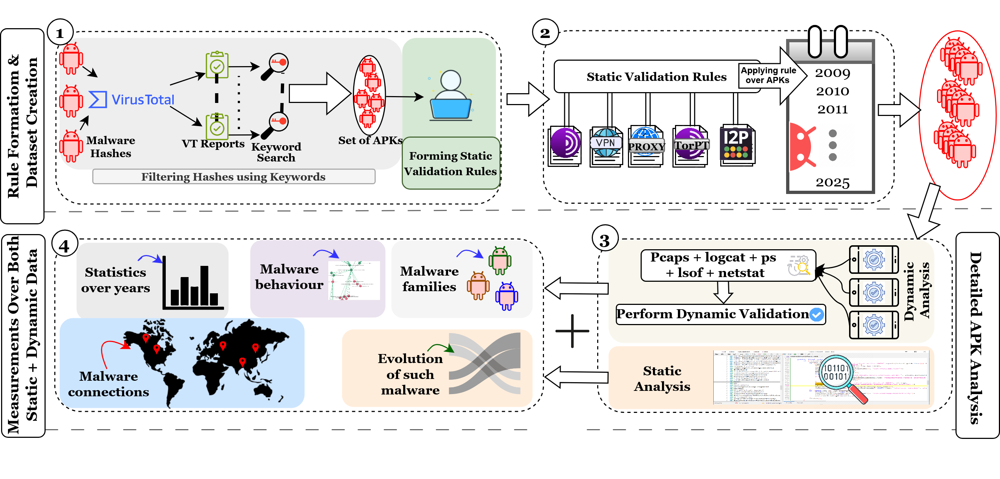

# The-Invisible-Ink
EuroS&amp;P'26 Artifacts

This repository contains the codebase, datasets, and supporting scripts used to conduct the measurement and analyses. For more details, please refer to our EuroS&amp;P paper "The Invisible Ink of the Android Malware World: A Longitudinal Study on the Usage of Covert Communication Channels". Refer to paper [arXiv version](https://arxiv.org/abs/2606.13107).

The repository is organized to reflect the stages of the pipeline:

* `assets/` — Figures and diagrams used in the paper
* `data/` — Hashes and metadata
* `static_analysis/` — Static APK analysis components
* `dynamic_analysis/` — Execution and logging on real devices
* `validation/` — Static and dynamic validation 
* `analysis/` — Measurement and analysis modules
* `results/` — Generated figures and tables

---

## The-Invisible-Ink Pipeline

  
   
  <!-- <em>Complete overview of our pipeline</em> -->

_More updates coming soon._